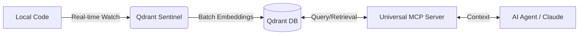

# Qdrant Universal MCP Server

A specialized [Model Context Protocol (MCP)](https://modelcontextprotocol.io/) server designed for seamless interaction with [Qdrant](https://qdrant.tech/) vector databases.

---

## 🤝 Better Together (Production-Grade RAG)

This MCP server handles the _retrieval_ and _management_ of vectors, but it works best when your data is already indexed. 

Pair it with **[Qdrant Sentinel](https://github.com/neco001/Qdrant_Sentinel.git)** — an automated codebase indexer that watches your local projects and keeps them synced with Qdrant in real-time. Together, they provide a seamless "memory" for your AI agents.

### 🔄 Data Flow


| Feature | Standard MCP Indexers | Qdrant Sentinel + Universal MCP |
| :--- | :---: | :---: |
| **Indexing Mode** | On-demand (stalls UI) | **Background Daemon** (Always-on) |
| **Multi-project** | Often single-folder | **Unlimited projects** via config |
| **Vector Integrity** | Basic (may pad vectors) | **Strict dimension enforcement** |
| **Model Support** | Often OpenAI only | **Universal Proxy** (DashScope, Ollama, etc.) |

---

## Why this one?

Most MCP servers for Qdrant are either too rigid (hardcoded dimensions) or too simple. This one is built for **real-world agentic workflows**:

- **Zero-Configuration Collections**: Just call `qdrant_store` on a new collection name. The server will generate an embedding, detect its dimensions, and create the collection automatically.
- **Universal Embedding Proxy**: Works with any OpenAI-compatible API (OpenAI, DashScope, Ollama/vLLM).
- **Search Integrity**: Enforces strict dimension checks. No destructive zero-padding.
- **AST-Aware Retrieval**: Integrated with `Qdrant Sentinel` to understand code structure (classes, functions, chunks).
- **Agentic Visibility**: Includes introspection tools (`qdrant_list_collections`, `qdrant_scroll`, `qdrant_list_symbols`) so LLMs can discover data structures autonomously.

## Tools

### 🔍 Discovery & Introspection
- `qdrant_list_collections`: List all available collections and their stats.
- `qdrant_list_symbols`: List unique symbols (classes, functions) in a collection, optionally filtered by `file_path`.
- `qdrant_scroll`: Browse through points/chunks in a collection.

### 🧠 Retrieval & Search
- `qdrant_search`: Search for similar texts. Supports `filter_metadata` (e.g., `{"language": "python", "symbol_type": "class"}`).
- `qdrant_get_symbol_code`: Reconstructs the full source code of a symbol from its distributed chunks.

### 💾 Management
- `qdrant_store`: Store text and metadata in a collection (creates collection if missing).
- `qdrant_optimize_collection`: Creates payload indexes for metadata fields to ensure blazing fast filtered searches.

## Prerequisites

Before using this MCP server, you need a running Qdrant instance and an Embedding API provider.

### 1. Set Up Qdrant (Vector Database)

#### Local Setup (Docker) - Recommended
```bash
docker run -d --name qdrant -p 6333:6333 -v qdrant_data:/qdrant/storage qdrant/qdrant
```

#### Qdrant Cloud
Sign up at [Qdrant Cloud](https://cloud.qdrant.io/) for a free cluster.

### 2. Set Up an Embedding Provider
Requires an OpenAI-compatible API:
- **DashScope (Qwen)**: Recommended for performance.
- **OpenAI / Gemini / Ollama**.

## Setup

1. **Environment Variables**: Copy `.env.example` to `.env` and fill in:
   - `QDRANT_URL`, `EMBEDDING_API_KEY`, `EMBEDDING_BASE_URL`, `EMBEDDING_MODEL_NAME`.

2. **Installation**:
   ```bash
   uv sync
   ```

## Usage

### Integration with Claude Desktop
Add to `claude_desktop_config.json`:
```json
{
  "mcpServers": {
    "qdrant-universal": {
      "command": "C:/path/to/server/.venv/Scripts/python.exe",
      "args": ["C:/path/to/server/qdrant_universal.py"],
      "env": {
        "QDRANT_URL": "http://localhost:6333",
        "EMBEDDING_API_KEY": "your-key",
        "EMBEDDING_BASE_URL": "...",
        "EMBEDDING_MODEL_NAME": "..."
      }
    }
  }
}
```

> [!TIP]
> On Windows, using `uv run` for MCP servers can cause "Access Denied" errors (`uv-trampoline`) when multiple sessions start simultaneously. Using the direct path to the `.venv` python interpreter is much more stable.

## License
MIT
